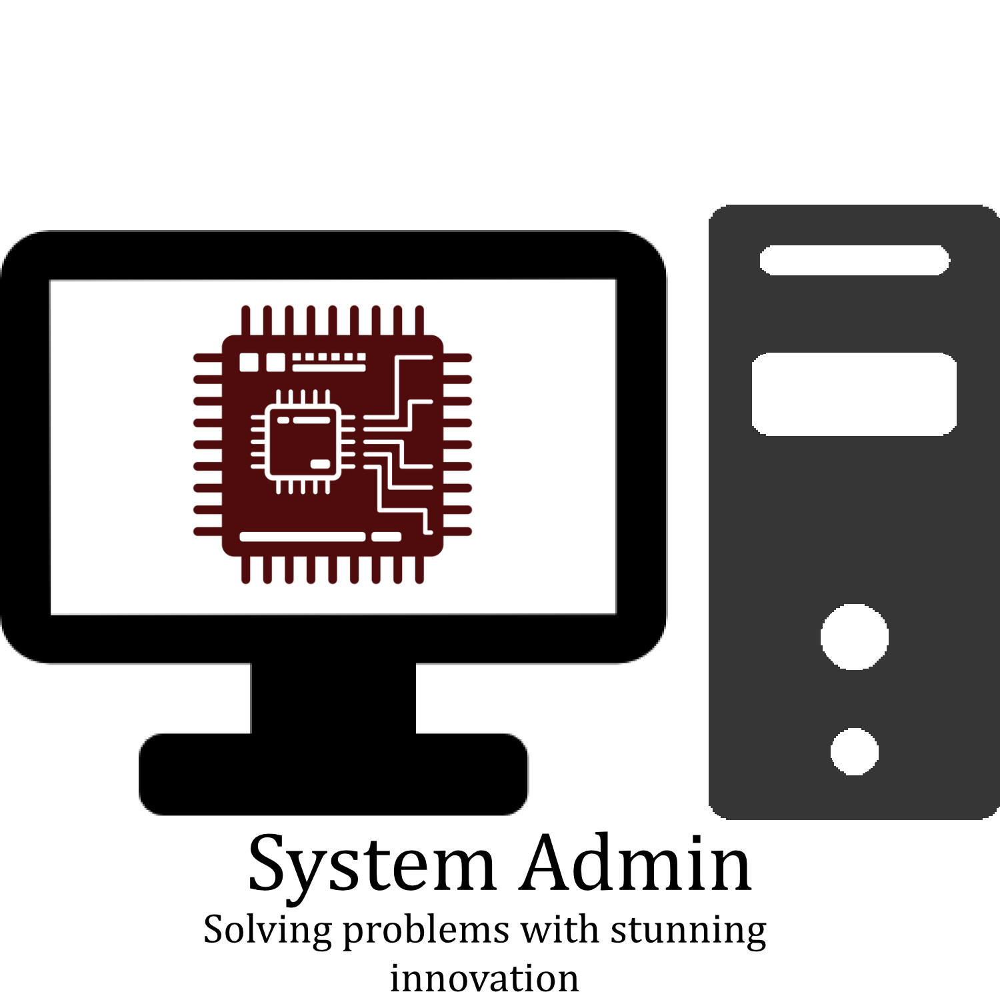

## Instructions
This project makes use of 3 Docker services to provide a UI for a LLM designed to help with SysAdmin and IT related issues. The base model used is llama3.2b instruct.

The 3 services provides are:
* Open-WebUI: Provides a nice interface for interacting with the LLM
* ChromaDB: Stores documents that the LLM uses for RAG
* Ollama: Service that provides the base model. The UI makes API calls to this service to query the model

### Prerequisites
To run the project you must have the following software installed on your system
* Docker
* Python 3 (latest version is best)
* Python Dependencies
```
pip install requests beautifulsoup4
``` 

### Setup
First, start the docker containers with the following command
```
docker compose up -d
```
If you'd like to view the container logs run
```
docker compose logs -f
```
When you want to stop the containers use
```
docker compose down
```

Once the containers have finished startup, navigate to `localhost:3000` in your web browser. Click the 'Get Started' button and make an account on the Open-WebUI instance.

Next, run the setup script using 
```
python setup.py
```
Please note the first time you run this will take a while because it has to download the model and upload all of the documents to the db, the script is not hanging... be patient

Refresh Open-WebUI

**Make sure to select "SysAdmin Helper" as the model**

Enter your query!